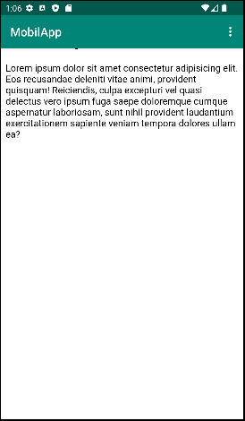

# Rapport

Jag började med att forka webview uppgiften och klonade den till min dator, sedan ändrade jag namnet på appen från "webviewapp" till "MobilApp" som kan ses i kodexempel 1.
Jag gav sedan appen tillgång till internet som kan ses i kodexempel 2. Därefter skapade jag en ny webview och tog bort den gamla textviewen från activity_main.xml med hjälp av det grafiska gränssnittet och efter det gav jag webviewen id:t "my_webview" som visas kodexempel 3.
Sedan i kodexempel 4, importerade jag webkittet "webview" och skapade variabeln "myWebView" med datatypen webview och kopplade den till id:t my_webview.
Sedan i kodexempel 5 skapade jag en webview client som jag kopplade till min webview och sedan laddade jag in his.se på webviewen.
Sen aktiverade jag javascript för webviewen med hjälp av webkittet websettings.
Till sist skapade jag en ny lokal html sida som placerades i en asset-folder, och laddade in den sidan i den interna web page funktionen. Jag ändrade då även så att his.se skulle laddas in i den externa web page funktionen.


Kodexempel 1:
```
<resources>
    <string name="app_name">MobilApp</string>
    ...
```
Kodexempel 2:
```
...
<uses-permission android:name="android.permission.INTERNET" />
...
```
Kodexempel 3:
```
 <WebView
        android:id="@+id/my_webview"
        android:layout_width="match_parent"
        android:layout_height="match_parent" 
 />
```
Kodexempel 4:
```
import android.webkit.WebView;
...
private WebView myWebView;
```
Kodexempel 5:
```
import android.webkit.WebViewClient;
import android.webkit.WebSettings;
...

    public void showExternalWebPage(){
        myWebView.loadUrl("https://his.se");
    }

    public void showInternalWebPage(){
        myWebView.loadUrl("file:android_asset/html/htmlsida.html");
    }

    private WebView myWebView;

    @Override
    ...
        myWebView = findViewById(R.id.my_webview);
        myWebView.setWebViewClient(new WebViewClient()); // Do not open in Chrome!


        WebSettings webSettings = myWebView.getSettings();
        webSettings.setJavaScriptEnabled(true);

        //noinspection SimplifiableIfStatement
        if (id == R.id.action_external_web) {
            Log.d("==>","Will display external web page");
            showExternalWebPage();
            return true;
        }

        if (id == R.id.action_internal_web) {
            Log.d("==>","Will display internal web page");
            showInternalWebPage();
            return true;
        }
    ...
```


Figur 1

Figur 2
